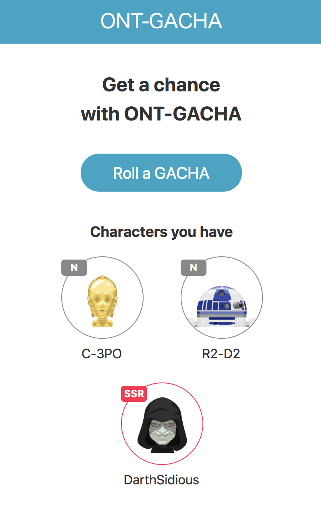
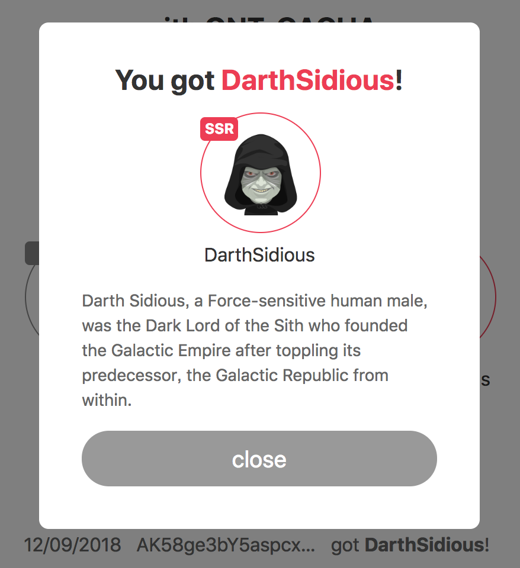

# ONT-GACHA

ONT-GACHA realizes trustful world for game lovers





## How to run development server

First, install `yarn`.

```
yarn install

# run development server
yarn start
```

## Configure Firebase app

Configuration for Firebase app is written in `config.ts`.

Setup your Firebase project and replace the config.

```
yarn firebase init
```

and deploy to Firebase Hosting using

```
yarn firebase deploy
```

## Contract and hash

`scriptHash` in `config.ts` value is a contract hash in TEST-NEW.

Deploy your contract and change this value to test.

## Acknowledgements

This project uses great avatar images for GACHA.

https://www.oxygenna.com/news/free-set-of-star-wars-avatars
